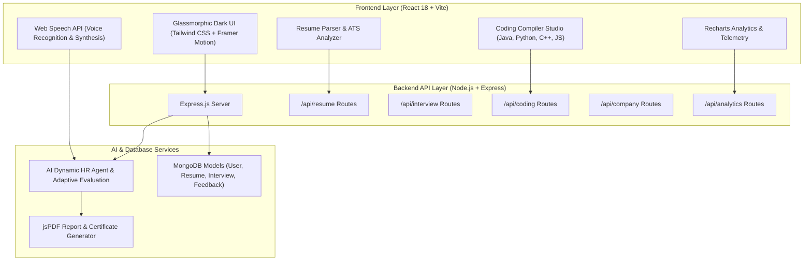

# InterviewAce AI 🚀
> **Your Personal AI Interview Preparation Assistant** (`InterviewPerep-Agent`)

---

## 🏛️ System Architecture



---

## ✨ Key Features

- 🤖 **Real AI HR Mock Interviewer**: Deep-scans candidate resume tags (Java, Python, React, Node, MongoDB, ML, DSA) and asks adaptive technical and project-specific questions.
- 📄 **Resume Parser & ATS Score**: Drag-and-drop uploader with skill extraction and ATS score breakdown out of 100.
- 🎯 **Behavioral STAR Suite**: Structured practice across 10 categories (Leadership, Conflict, Failure, Success, Teamwork, Communication, etc.).
- 💻 **Coding Compiler Studio**: Practice two-sum and algorithm problems in **Java, Python, C++, and JavaScript** with automated test case validation.
- 🎙️ **Voice Studio**: Hands-free voice recognition with live audio transcription and Speech Synthesis.
- 📊 **Analytics & Telemetry**: Recharts radar charts, pie charts, and weekly confidence growth trends.
- 🏢 **Company-Wise Packs**: Presets for Google, Amazon, Microsoft, Netflix, Meta, TCS, Infosys, Zoho, Accenture, Wipro.
- 🏆 **Gamification & Rewards**: Daily challenges (+50 XP), streak tracking, community leaderboard, and downloadable PDF Certificates.

---

## 🛠️ Tech Stack

- **Frontend**: ReactJS, Vite, Tailwind CSS, Framer Motion, Lucide Icons, Recharts, React Router DOM, Web Speech API, jsPDF.
- **Backend**: Node.js, Express.js, Multer, REST APIs.
- **Database Schemas**: MongoDB / Mongoose models (User, Resume, Interview, Feedback).

---

## 🚀 Getting Started

### 1. Clone the repository
```bash
git clone https://github.com/YOUR_USERNAME/InterviewPerep-Agent.git
cd InterviewPerep-Agent
```

### 2. Install & Run Backend Server
```bash
cd backend
npm install
npm start
```
*Backend runs on `http://localhost:5000`*

### 3. Install & Run Frontend Client
In a new terminal window:
```bash
cd frontend
npm install
npm run dev
```
*Frontend runs on `http://localhost:3000`*

---

## 📜 License
Licensed under the [MIT License](LICENSE).
